<!-- TOC depthFrom:1 depthTo:6 withLinks:1 updateOnSave:1 orderedList:0 -->

- [PROSESLER](#prosesler)
	- [PID - PROSES ID](#pid-proses-id)
	- [UID - USER ID](#uid-user-id)
	- [PPID - PARENT PROCESS ID](#ppid-parent-process-id)
	- [MEVCUT SÜREÇLERİN GÖRÜNTÜLENMESİ](#mevcut-sürelerin-görüntülenmesi)
	- [KULLANICI SURECLERI GORUNTULENMESI](#kullanici-surecleri-goruntulenmesi)
	- [CANLI OLARAK SÜREÇLERİN GÖRÜNTÜLENMESİ](#canli-olarak-sürelerin-görüntülenmesi)
		- [HTOP KOMUTU KULLANIMI](#htop-komutu-kullanimi)
	- [SURECLERIN SONLANDIRILMASI](#sureclerin-sonlandirilmasi)
		- [SUDO ILE ACILAN UYGULAMANIN SONLANDIRILMASI](#sudo-ile-acilan-uygulamanin-sonlandirilmasi)
	- [SÜREÇ SONLANDIRMA ÇEŞITLERI](#süre-sonlandirma-eitleri)
		- [PKILL ILE SONLANDIRMA](#pkill-ile-sonlandirma)
	- [SERVIS KAVRAMI](#servis-kavrami)
		- [SERVIS CESITLERI](#servis-cesitleri)
		- [SERVISLERIN GORUNTULENMESI](#servislerin-goruntulenmesi)
			- [ÇALIŞAN SERVİSLERİ GÖRÜNTÜLEME](#alian-servisleri-görüntüleme)
			- [ÇALIŞAN SERVİSLER HAKKINDA BİLGİ ALMA](#alian-servisler-hakkinda-bilgi-alma)
			- [MEVCUT SERVIS ILE ILGILI DUZENLEME YAPMA](#mevcut-servis-ile-ilgili-duzenleme-yapma)
			- [MEVCUT SERVISI YENIDEN BASLATMA](#mevcut-servisi-yeniden-baslatma)

<!-- /TOC -->


# PROSESLER
Linux altında çalışan her program bir süreçtir

## PID - PROSES ID
Prosese ait kimliktir

## UID - USER ID
Bu process'i kullanan user'a ait olan id'dir.

## PPID - PARENT PROCESS ID  

## MEVCUT SÜREÇLERİN GÖRÜNTÜLENMESİ

Çalışan süreçlerin görüntülenmesi
```bash
ps -ef
```
bu komut

```bash
man ps
```
ile incelenebilir.

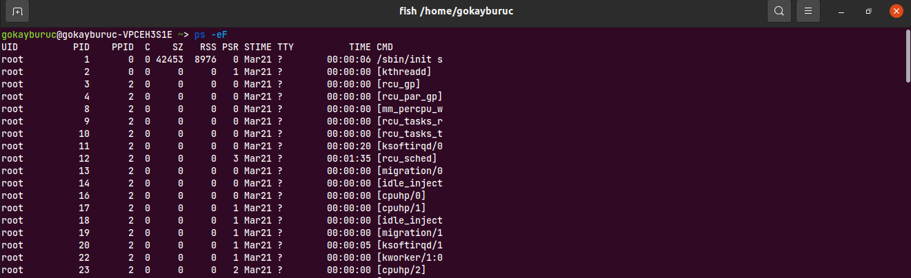

## KULLANICI SURECLERI GORUNTULENMESI

```bash
ps -au{username}

ps -augokayburuc #gokayburuc kullanicisina ait processler
ps -auroot # root'a ait olan processler
```
Örnek çıktı:

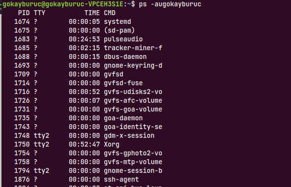

## CANLI OLARAK SÜREÇLERİN GÖRÜNTÜLENMESİ

```bash
ps -aux

```
Bilgisayara paket yükleyerek `htop` uygulaması yüklenmesi

### HTOP KOMUTU KULLANIMI
```bash
sudo apt install htop
```

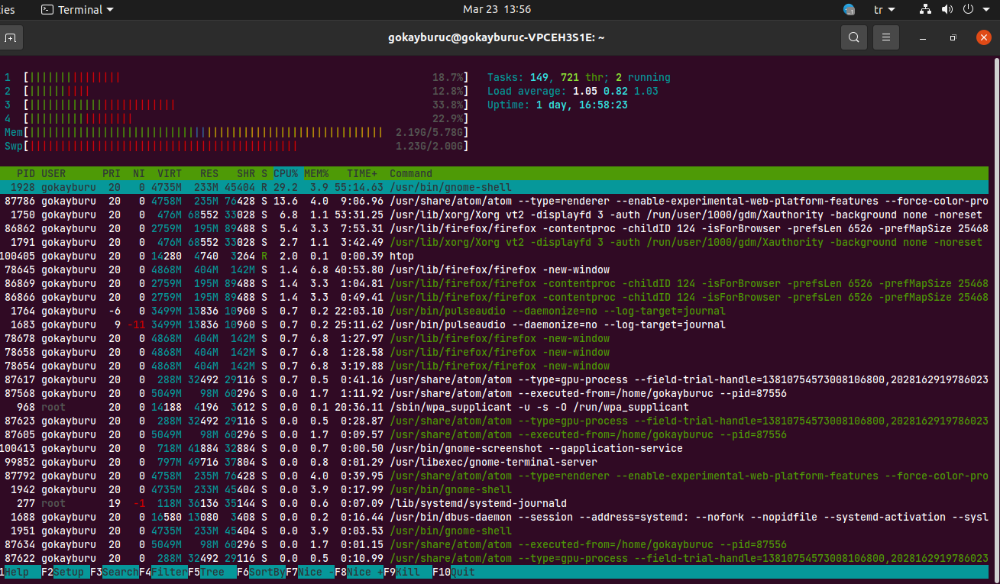

Htop içerisinde iken **F5** ile süreçlerin hangi süreçlerin altında çalıştığını ağaç diyagramı ile görebiliriz.

## SURECLERIN SONLANDIRILMASI

```bash
kill {PID}
```
ilk olarak terminalde bir uygulama calistiriyoruz
```bash
gedit
```
Terminalde bir uygulamayı direkt olarak yazdığımızda terminal o uygulama ile eşleşir.Terminalde yeni bir tab sekmesi açmak için **CTRL+SHIFT+T** tuş kombinasyonunu kullanıyoruz.

Aşağıdaki komut ile görüntülüyoruz

```bash
ps -ef
```
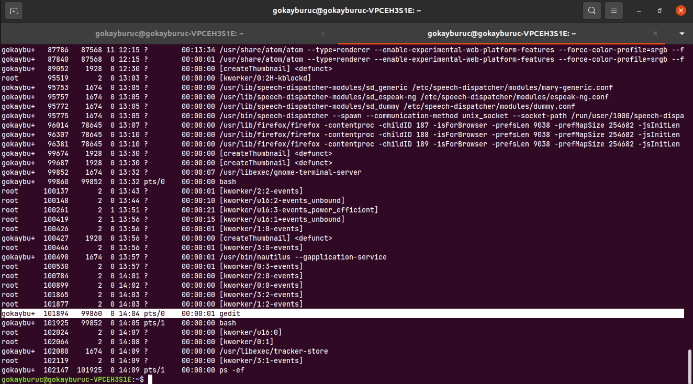

gedit uygulamasına ait `PID` bulunduktan sonra aşağıdaki komutu yazıyoruz.

```bash
kill 101894
```

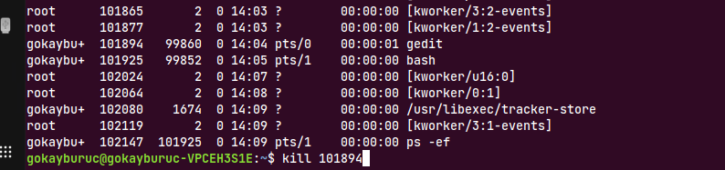

Böylece çalışan uygulama sonlanıyor.  

Program sonlandiktan sonra kontrol için aşağıdaki komutu yazdiğimizda karsimiza resimdeki gibi bir cikti gelir.

```bash
ps -ef | grep gedit
```

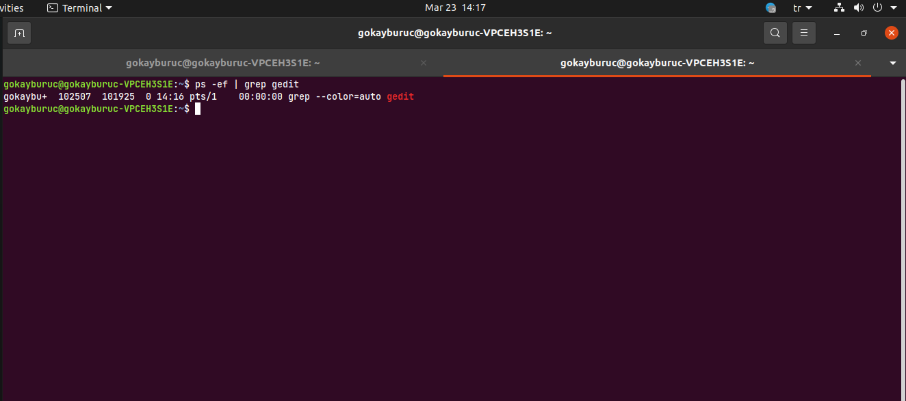

Buradaki gördüğünüz `PID` çalıştırılan grep komutuna ait renklendirmenin çıktısıdır. gedit sistemde çalışmamaktadır.


### SUDO ILE ACILAN UYGULAMANIN SONLANDIRILMASI

Eğer ayni kodu `root` altında çalıştırılırsa `gokayburuc` kullanicisi tarafindan sonlandirilamaz.

```bash
sudo gedit # buraya kullanici sifresi giriliyor
```
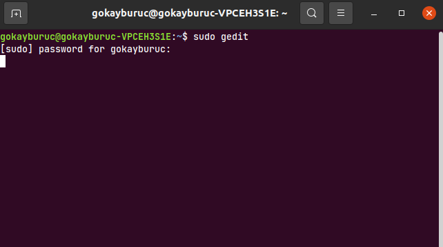

Ekranda görüntüleme için aşağıdaki komutu kullanıyoruz.

```bash
ps -ef | grep gedit
```

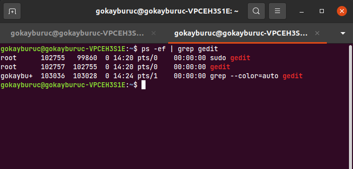

Bu program `gokayburuc` kullanicisi tarafindan sonlandirilamaz. Cunku program `root` altında açıldı.

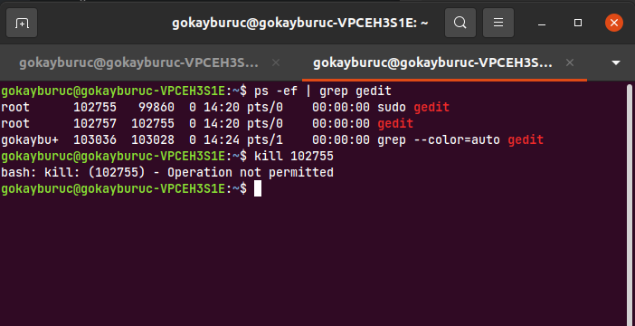

Bu programi sonlandirmak için aşağıdaki şekilde `root` yetkisi ile işlem yapmamız gerekiyor.

```bash
sudo kill 102755 # root erisim sifresi gerekiyor
```


## SÜREÇ SONLANDIRMA ÇEŞITLERI

Sonlandırmak istediğiniz uygulamaya ait PID kodunu bulduktan sonra aşağıda yer alan kodlardan sonlandırma işlemini gerçekleştirebilirsiniz.

* 9) SIGKILL (Program her ne yapıyorsa yapsın anında kapat)
* 15) SIGTERM (Program yaptığı işi sonlandırana kadar bekle ve kapat)

```bash
kill -l
```
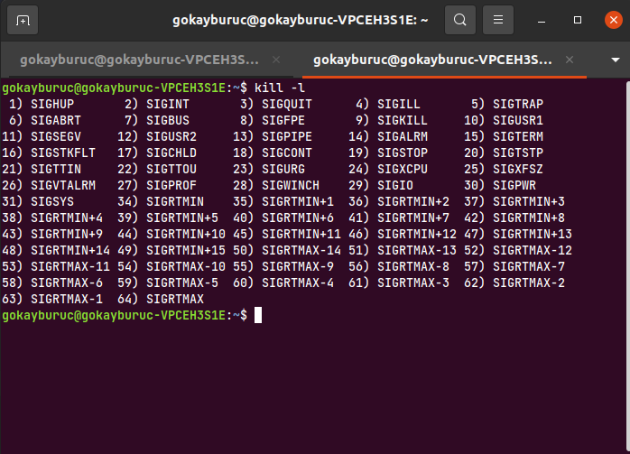

Bu şekilde bir uygulama kapatmak istediğiniz de aşağıdaki kodu yazarak programı sonlandırabilirsiniz.

```bash
kill -9 15575   # kill -9 {PID}
kill -15 15575  # kill -15 {PID}
```

### PKILL ILE SONLANDIRMA

Aynı şekilde programlarınızı `pkill` komutu ile de sonlandırabilirsiniz.

```bash
pkill gedit # pkill {processname}
```

## SERVIS KAVRAMI

Arka planda sürekli gerektiğinde kullanılmak için çalışan uygulamalara servis denir.

### SERVIS CESITLERI

- Kullanıcı Servisleri
- Web Servisleri
- Sanallaştırma Servisleri
- Uzaktan Erişim Servisleri
- Log Servisleri


### SERVISLERIN GORUNTULENMESI

Sistemde çalışan servislerin görüntülenmesi için aşağıdaki komut kullanılır.

```bash
systemctl list-units --type service
```

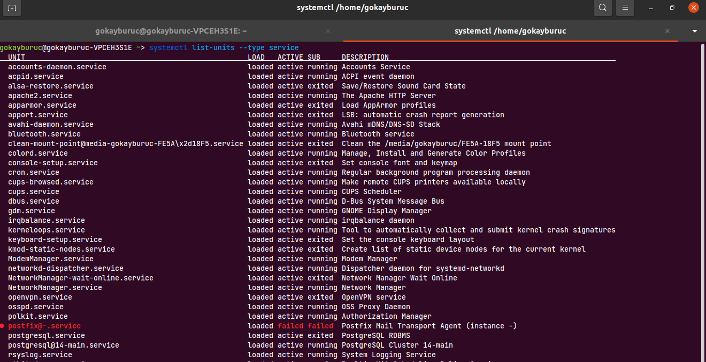

#### ÇALIŞAN SERVİSLERİ GÖRÜNTÜLEME

Yukarıdaki komutta sistemdeki tüm servisleri görüntülüyoruz. Fakat sadece sistemde aktif olarak çalışan servisleri görmek istediğimizde komuta aşağıdaki eklemeyi yapmamız gerekir.

```bash
systemctl list-units --type service --state running
```
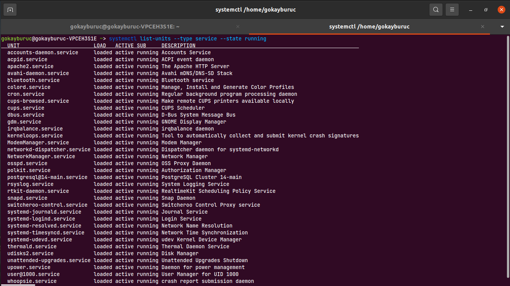


#### ÇALIŞAN SERVİSLER HAKKINDA BİLGİ ALMA

```bash
systemctl status postgresql@14-main.service
```
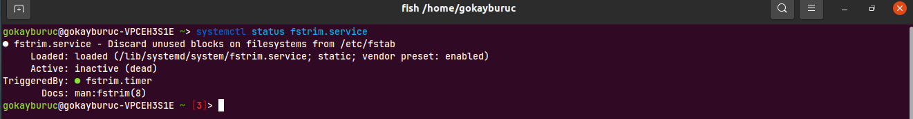

#### MEVCUT SERVIS ILE ILGILI DUZENLEME YAPMA


```bash
systemctl status cron.service # buradaki output'ta loaded kısmından geri donus saglandi
cat  /lib/systemd/system/cron.service
batcat /lib/systemd/system/cron.service
```
Yukarıda verilen komutlar ile sistem uzerinde calisan servis tespit edilip servis icerigine girildi. Oradan `nano` yardımı ile sistem duzenlendi.

#### MEVCUT SERVISI YENIDEN BASLATMA

Eğer servis yeniden başlatılacaksa sistemde bu servise ait isim

```bash
systemctl list-units --type service --state exited #sistemde goruntuleme saglandı
systemctl restart corn.service
```
