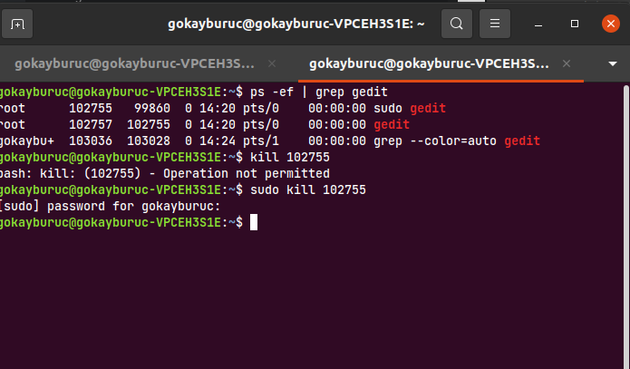

<!-- TOC depthFrom:1 depthTo:6 withLinks:1 updateOnSave:1 orderedList:0 -->

- [PROSESLER](#prosesler)
	- [PID - PROSES ID](#pid-proses-id)
	- [UID - USER ID](#uid-user-id)
	- [PPID - PARENT PROCESS ID](#ppid-parent-process-id)
	- [MEVCUT SÜREÇLERİN GÖRÜNTÜLENMESİ](#mevcut-sürelerin-görüntülenmesi)
	- [KULLANICI SURECLERI GORUNTULENMESI](#kullanici-surecleri-goruntulenmesi)
	- [CANLI OLARAK SÜREÇLERİN GÖRÜNTÜLENMESİ](#canli-olarak-sürelerin-görüntülenmesi)
		- [HTOP KOMUTU KULLANIMI](#htop-komutu-kullanimi)
	- [SURECLERIN SONLANDIRILMASI](#sureclerin-sonlandirilmasi)
		- [SUDO ILE ACILAN UYGULAMANIN SONLANDIRILMASI](#sudo-ile-acilan-uygulamanin-sonlandirilmasi)
	- [süreç sonlandırma çeşitleri](#süre-sonlandrma-eitleri)

<!-- /TOC -->


# PROSESLER
Linux altında çalışan her program bir süreçtir

## PID - PROSES ID
Prosese ait kimliktir

## UID - USER ID
Bu process'i kullanan user'a ait olan id'dir.

## PPID - PARENT PROCESS ID  

## MEVCUT SÜREÇLERİN GÖRÜNTÜLENMESİ

Çalışan süreçlerin görüntülenmesi
```bash
ps -ef
```
bu komut

```bash
man ps
```
ile incelenebilir.


## KULLANICI SURECLERI GORUNTULENMESI

```bash
ps -au{username}

ps -augokayburuc #gokayburuc kullanicisina ait processler
ps -auroot # root'a ait olan processler
```
Örnek çıktı:


## CANLI OLARAK SÜREÇLERİN GÖRÜNTÜLENMESİ

```bash
ps -aux

```
Bilgisayara paket yükleyerek `htop` uygulaması yüklenmesi

### HTOP KOMUTU KULLANIMI
```bash
sudo apt install htop
```


Htop içerisinde iken **F5** ile süreçlerin hangi süreçlerin altında çalıştığını ağaç diyagramı ile görebiliriz.

## SURECLERIN SONLANDIRILMASI

```bash
kill {PID}
```
ilk olarak terminalde bir uygulama calistiriyoruz
```bash
gedit
```
Terminalde bir uygulamayı direkt olarak yazdığımızda terminal o uygulama ile eşleşir.Terminalde yeni bir tab sekmesi açmak için **CTRL+SHIFT+T** tuş kombinasyonunu kullanıyoruz.

Aşağıdaki komut ile görüntülüyoruz

```bash
ps -ef
```


gedit uygulamasına ait `PID` bulunduktan sonra aşağıdaki komutu yazıyoruz.

```bash
kill 101894
```


Böylece çalışan uygulama sonlanıyor.  

Program sonlandiktan sonra kontrol için aşağıdaki komutu yazdiğimizda karsimiza resimdeki gibi bir cikti gelir.

```bash
ps -ef | grep gedit
```


Buradaki gördüğünüz `PID` çalıştırılan grep komutuna ait renklendirmenin çıktısıdır. gedit sistemde çalışmamaktadır.


### SUDO ILE ACILAN UYGULAMANIN SONLANDIRILMASI

Eğer ayni kodu `root` altında çalıştırılırsa `gokayburuc` kullanicisi tarafindan sonlandirilamaz.

```bash
sudo gedit # buraya kullanici sifresi giriliyor
```


Ekranda görüntüleme için aşağıdaki komutu kullanıyoruz.

```bash
ps -ef | grep gedit
```


Bu program `gokayburuc` kullanicisi tarafindan sonlandirilamaz. Cunku program `root` altında açıldı.


Bu programi sonlandirmak için aşağıdaki şekilde `root` yetkisi ile işlem yapmamız gerekiyor.

```bash
sudo kill 102755 # root erisim sifresi gerekiyor
```




## süreç sonlandırma çeşitleri

```bash
kill -l 
```
