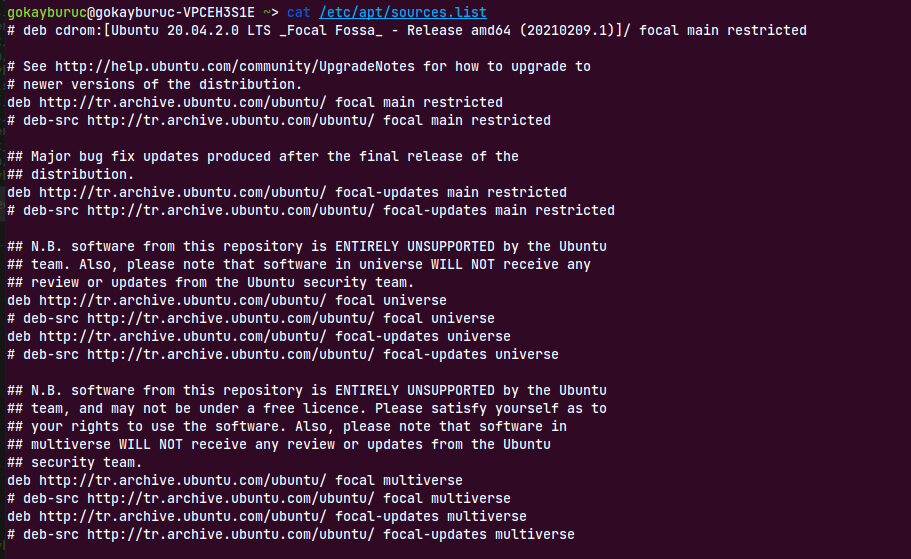
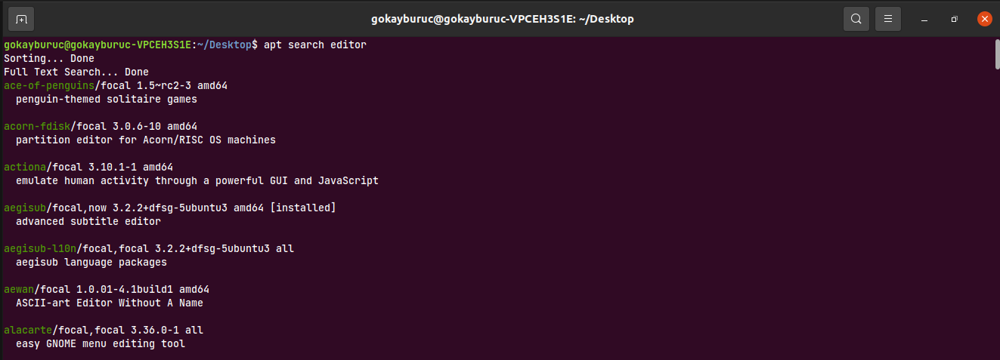
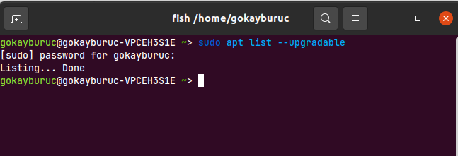

[TOC]


# LINUX 401

## PAKET VE GÜNCELLEME İŞLEMLERİ
Paket, bilgisayara kurulacak uygulamaya ait tüm gereksinimleri bir arada barındıran yapıdır.

### APT PAKET YONETICISI
Bilgisayara paket yükleme silme,güncelleme gibi işlemleri yapan paket yönetim sistemidir. 
#### PAKET LISTESI GUNCELLEME

Paket listelerini görüntüleme ve güncelleme için aşağıdaki komutları kullanırız. `root` erisimi gerektigi icin `sudo` ile paket guncellemesini yapabiliriz.

```bash
sudo apt update
apt update
```
#### PAKET LISTESINI GORUNTULEME

Bilgisayarın paketleri güncellemek için hangi web link kaynaklarını barındırdığını gösteren dizindir.
```bash
cat /etc/apt/sources.list
```



#### PAKET KURULUMU YAPMA

Kurulumunu yapmak istedigimiz paketin ismini yazarak ve **Enter**'a basarak paket kurulumunu otomatik olarak gerceklestirebiliriz.

```bash
apt install gimp
```

#### PAKET ISMI ARAMA 

Herhangi bir paketi direkt ismini bilemiyorsak onu bir **keyword** aracılığıyla arayabiliriz.

```bash
apt search editor 
sudo apt search editor 
```



#### GUNCELLENEBİLİR PAKETLERİ GORUNTULEME 

Guncellenebilir paketlerin tam listesini asagidaki komut ile goruntuleyebiliriz.

```bash
apt list --upgradeble
sudo apt list --upgradeble
```


Eger cikti sayisi fazla ise islemin ciktisini `wc` komutu ile satir olarak saydirabiliriz.

```bash
apt list --upgradeble | wc
sudo apt list --upgradeble | wc
```
#### PAKET GUNCELLEME

Toplu olarak guncelleme yukseltmek icin asagidaki komutu kullaniriz.

```bash 
apt-get upgrade 
sudo apt-get upgrade
```

#### PAKET KALDIRMA 

Sileceğimiz paketin adini `apt remove`'dan sonra yazarak paket kaldırma islemini gerceklestirebiliriz.

```bash
apt remove vlc 
```

##### purge komutu 

```bash
apt purge vlc 
```

##### autoremove komutu

Sistemde yer alan tum gereksiz paketler listelenir ve bu paketlerin hepsi toplu olarak sistemden kaldirilir.

```bash
apt autoremove
```

### PAKET DOSYASINDAN PAKET KURULUMU 

```bash
dpkg -i typora_1.1.5_amd64.deb 
sudo !! #hizli sekilde bir ust satirdaki yazilan komutu sudo komutunun yanina getirir 
```

#### dpkg -l ile sistemdeki paketleri goruntuleme 

sistemde kurulu olan paketlerin hepsini goruntuler

```bash 
dpkg -l 
```

#### dpkg -r ile sistemden paket kaldirma

```bash
dpkg -r code
```

#### dpkg --purge ile sistemden dosya silme

sistemden kaldirilan fakat ayarlari mevcut olan dosyalari siler.

```bash
dpkg --purge code 
```

### Shell Programlama

```bash
nano my_script.sh
```

Açılan dosya içerisine aşağıdaki gibi bir eklenti yazalim.

```bash
#!/bin/sh
echo "dosya acildi"
touch harun_abi.txt
echo "merhaba harun abi" >> harun_abi.txt
```

Şimdi açılan dosyayi aşağıdaki kod ile çalıştırmayi deneyelim

```bash
./my_script.sh
```

Burada hata almamızın sebebi dosyanin sistem tarafından `executable` olmamasi yani `-x` modunda olmamasidir.

```bash
chmod +x my_script.sh
```

Yukarıdaki kodu yazdiktan sonra dosyamiz executable halini aldı.Simdi dosyamizi calistirabiliriz. 

#### BASH & SH FARKLARI

* POSIX nedir? 

- sh nedir?
- bash nedir?
- dash nedir?

Debian tabanlı isletim sistemlerinde sh kabugu dash e yonlendirilmistir.

```bash
file -h /bin/sh
file -h /bin/bash
file -h /bin/dash
```


#### SHELL PROGRAMLAMA UYGULAMASI

##### Shell Programlama Örneği

```bash
nano deneme1.sh
```

oluşturduğumuz bu dosya icine aşağıdaki satirlari yazalim 

```bash
#!/bin/bash
echo "isminizi yaziniz: " #ekranda isminizi yazin olarak ifade goruntuler
read isim # ekrandan girdi alinip isim degiskeni olarak tutulur 
echo "merhaba $isim ! platformumuza hosgeldiniz!"

# matematik islemlerinin yapilmasi
((toplam = 22 / 7))
echo $toplam #toplam isimli matematik operatorunun sonucunu ekrana yazdirir

```


##### Shell Programlama Örneği - 2 

Koşullu değişkenlerin yer aldığı diğer bir kabuk programı yazıyoruz.

```bash
nano kimlikdogrulama.sh
```


Simdi bu dosya icine asagidaki kodlari girelim.

```bash
#!/bin/bash
echo "kullanıcı adinizi giriniz: "
read login 
echo "kullanici parolanizi giriniz:"
read userpass 

if [[($login =="gokay" && $userpass == "gokay123")]]; then
echo "merhaba $login ! Platforma hosgeldin"
else "giris basarisiz yeniden deneyin!"
fi 

```


##### Loop (Döngü) Yazımı 

`nano` aracılığıyla yeni bir script yaziyoruz. 

```bash
nano kimlikdogrulama_loop.sh
```

Yazdığımız bu script dosyasına aşağıda yer alan kodu giriyoruz.

```bash
#!/bin/bash
echo "kullanıcı adinizi giriniz: "
read login
echo "kullanici parolanizi giriniz:"
read userpass

if [[ $login == "gokay" ]] && [[ $userpass ==  "gokay123" ]] 
then
giris=true
echo "merhaba $login ! Platforma hosgeldin"
else "giris basarisiz yeniden deneyin!"
giris=false
fi

sayac=1

while [ $giris ]
do
echo $sayac

if [[ $sayac -eq 10 ]] 
then
break
fi

((sayac++))
done

```

Burada yazımda farklılık olmasının sebebi `bash` script için bir yazım yapılmasıdır.

```bash
bash kimlikdogrulama_loop.sh
```

##### Bir Shell Script'ten Başka Bir Script Çağırma

```bash
nano tarih.sh 
```

Yazilan bu programın içine tarih goruntulemek icin asagidaki komut girilir. 

```bash
#!/bin/bash
echo "Merhaba!"
date
echo
cal
echo "Gorusmek uzere!"
```

Program çalıştırılınca aşağıdaki şekilde bir çıktı alınır.


Başka bir örnekte calisalim. 

```bash
touch script_calistir.sh
nano script_calistir.sh
```

Yazılan bu kimlik doğrulama uzerinden simdi de `tarih.sh` scriptini cagiralim.Nano ile dosyanin icine asagidaki kodu yazalim.

```bash
#!/bin/bash
bash tarih.sh
```


## Özgür Yazılım Dünyası

Özgür yazılım kamuya mal olmuş yazılımdır. 

Özgür yazılım lisansları aşağıdaki şekillerde olabilir. 

* GNU - Genel Kamu Lisansı (GPL)
* GNU FDL
* Creative Commons 
* Mozello
* BSD
* LGPL
* AGPL

Açık kaynaklı kodlu yazılım ile özgür yazılım farklı kavramlardır. 

* Özgür Yazılım - Free Software 

* Açık Kaynak Kodlu Yazılım - Open Source Software 

#### GNU KAVRAMI 


> **GNU**:
>
> GNU is an operating system that is free software—that is, it respects users' freedom. The GNU operating system consists of GNU packages (programs specifically released by the GNU Project) as well as free software released by third parties. The development of GNU made it possible to use a computer without software that would trample your freedom.

Resource : [GNU PHILOSOPHY](https://www.gnu.org/philosophy/philosophy.html)

Özgür Yazılım aşağıdaki 4 temel hakkı sağlar.

1. - (0) to run the program - Programı çalıştırma
2. - (1) to study and change the program in source code form, - Program üzerinde değişiklik yapma ve programa istediğini yaptırabilme hakkı
3. - (2) to redistribute exact copies,  - Kopyaları dağıtma hakkı
4. - (3) to distribute modified versions. - Değiştirilmiş versiyonları dağıtma hakkı

#### UBUNTU DAĞITIMI İLE İLGİLİ BİLGİ 

Ubuntu yazılımı birçok farklı lisansın birleşimi olarak yayınlanmış bir yazılımdır.

#### GNU DESKTOP ENVIRONMENT LISTESI

| arayüz cesidi | resmi sitesi                           |
| ------------- | -------------------------------------- |
| Unity         | https://unity8.io/                     |
| XCFE          | https://xfce.org/                      |
| GNOME         | https://www.gnome.org/                 |
| MATE          | https://mate-desktop.org/              |
| KDE           | https://kde.org/                       |
| Cinnamon      | https://cinnamon-spices.linuxmint.com/ |
| Budgie        | https://getsol.us/home/                |
| LXQt          | https://lxqt-project.org/              |
| LXDE          | https://www.lxde.org/                  |

